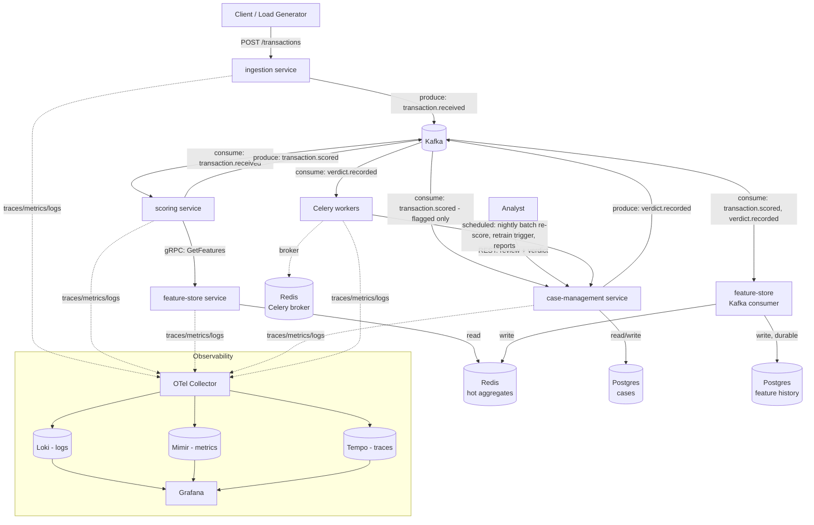

# Architecture: Real-Time Fraud & Risk Scoring Platform

Status: design doc, pre-implementation. Reflects the architecture decisions made before writing any code — see `CLAUDE.md` for the project vision this implements.

## 1. Overview

The platform ingests financial transactions, scores each one for fraud risk within a hard latency budget (target: p99 < 100ms for the scoring path), and routes flagged transactions to human analysts whose verdicts feed back into future scoring. It is built as four services with clear ownership boundaries, split along two axes:

- **Latency-critical path** (must answer synchronously, fast): `ingestion` → `scoring` → `feature-store`, connected by gRPC.
- **Event-driven path** (react-eventually, durable, replayable): transaction lifecycle and analyst verdicts flow through Kafka, consumed by `feature-store` (to update rolling aggregates), `case-management` (to surface flagged transactions), and Celery workers (batch re-scoring, retraining triggers, reporting).

Every service is instrumented with OpenTelemetry and exports to a shared collector, so a single transaction's journey — HTTP request → gRPC call → Kafka hop → Celery task — is visible as one trace, correlated with logs and metrics.

### Service list

| Service | Role | Interface | State |
|---|---|---|---|
| `ingestion` | Accepts incoming transactions, validates, publishes to Kafka | REST (FastAPI) | Stateless |
| `scoring` | Hot-path fraud decisioning: rules + score, calls feature-store for context | gRPC (consumer of Kafka + gRPC server) | Stateless |
| `feature-store` | Maintains and serves real-time behavioral features (velocity, historical aggregates) | gRPC server + Kafka consumer | Redis (hot reads) + Postgres (system of record) |
| `case-management` | Analyst-facing API: review flagged transactions, record verdicts | REST (FastAPI) + Kafka producer | Postgres |

## 2. Architecture diagram

## 3. End-to-end example: one transaction's journey

Walking a single transaction through every service, in order:

1. **Ingestion.** A client sends `POST /transactions` to `ingestion`. It validates the payload shape (amount, account, merchant, timestamp, metadata), rejects malformed input synchronously, publishes a `transaction.received` event to Kafka, and returns `202 Accepted` with a transaction ID — without waiting for a score.

2. **Scoring.** `scoring` consumes `transaction.received` off Kafka. It calls `feature-store` over gRPC (`GetFeatures`) to fetch the account/merchant's current behavioral features, runs its rules + scoring function against them, and publishes `transaction.scored` with `{score, decision, reasons[]}` — the `reasons[]` are what makes the decision explainable rather than a bare number. This whole hop (Kafka consume → gRPC call → Kafka produce) is what the p99 < 100ms SLA is measured against.

3. **Feature store update.** `feature-store`'s Kafka consumer picks up the same `transaction.scored` event and updates its Redis rolling aggregates (5m/1h/24h velocity, deviation from historical average), durably persisting the new snapshot to Postgres so the aggregates can be audited or rebuilt later.

4. **Case management.** If the decision was `FLAGGED`, `case-management` consumes `transaction.scored` and persists it into its Postgres `cases` table. An analyst reviews it via REST, sees the transaction and its `reasons[]`, and records a verdict — confirmed fraud or false positive.

5. **Feedback loop.** Recording the verdict publishes `verdict.recorded` to Kafka. `feature-store` consumes it to adjust that account's future feature computation (e.g., a confirmed-fraud account should influence its own future risk features), and Celery consumes it to trigger batch re-scoring of related transactions, retraining-signal aggregation, and analyst reporting.

6. **Observability, throughout.** Every step above propagates trace context — the REST call, the Kafka hops, the gRPC call, the eventual Celery task — so this one transaction shows up as a single connected trace in Tempo, correlated with its logs in Loki and reflected in Mimir's metrics (consumer lag, decision distribution, cache hit rate).

## 4. Service functionality

### `ingestion`
- REST endpoint (`POST /transactions`) — the only public entry point for new transactions.
- Validates payload shape (amount, account, merchant, timestamp, metadata) and does cheap, synchronous rejection (malformed input) before anything touches Kafka.
- Publishes a `transaction.received` event and returns `202 Accepted` with a transaction ID immediately — it does **not** wait for a score. Callers needing the score poll `case-management` or (later) subscribe to a webhook/websocket.
- Deliberately stateless and horizontally scalable; it's the front door under burst load, not the bottleneck.

### `scoring`
- Kafka consumer on `transaction.received`; this is the hot path the whole platform's SLA is measured against.
- For each transaction: calls `feature-store` over gRPC (`GetFeatures(account_id, merchant_id, window)`) to get current velocity/behavioral features, runs a rules layer plus a scoring function against those features, and produces a `transaction.scored` event carrying `{score, decision, reasons[]}` — the `reasons` array is the explainability requirement: every decision names the features that drove it.
- Exposes its own gRPC endpoint too (`ScoreTransaction`) for synchronous callers that need a same-request answer (e.g., a future checkout-flow integration) — Kafka path and gRPC path share the same scoring core, just different entry points.
- Stateless; scales horizontally with consumer group partitioning on Kafka.

### `feature-store`
- Owns the "what does this account/merchant normally look like" question — the platform's core differentiator, and the piece most at risk of becoming stale or slow.
- Two responsibilities, structurally separate: a **gRPC server** (`GetFeatures`) serving hot reads out of Redis for `scoring`'s latency-bound path, and a **Kafka consumer** that updates those Redis aggregates (and durably persists them to Postgres) as `transaction.scored` and `verdict.recorded` events arrive.
- Redis holds rolling-window aggregates (e.g., transaction count/sum in last 5m/1h/24h per account, deviation from historical average) — sub-millisecond reads, acceptable to lose and rebuild from Postgres + Kafka replay if it goes down.
- Postgres is the system of record: every feature snapshot is written durably so the platform can replay history, audit "what did the model see when it made this decision," and rebuild Redis from scratch.

### `case-management`
- REST API for analysts: list flagged transactions (`transaction.scored` events where `decision == FLAGGED`, consumed off Kafka and persisted), view the reasons/features behind a flag, and submit a verdict (confirm fraud / false positive).
- Owns the Postgres `cases` table — the durable record of every flag and its resolution.
- Publishes `verdict.recorded` on every analyst decision. This is the feedback loop: `feature-store` uses it to adjust future feature computation (e.g., a confirmed-fraud account should influence its own future features), and Celery uses it as a trigger for batch re-scoring of related transactions and periodic retraining-signal aggregation.

### Celery workers
- Not a "service" with an API — a pool of workers consuming from a Redis-backed broker, handling anything that shouldn't sit on a request/response or a hot Kafka path:
  - Scheduled batch re-scoring (e.g., re-run scoring against updated rules across the last 24h of transactions).
  - Retraining-signal aggregation (bundling `verdict.recorded` events into a dataset snapshot — no live model training in scope for v1, but the trigger/pipeline plumbing is).
  - Report generation and analyst digest emails.
- Also Kafka-consumer-adjacent: a lightweight consumer hands qualifying events to Celery as tasks rather than processing them inline, keeping Celery's queueing/retry/scheduling semantics separate from Kafka's stream semantics.

## 5. Communication patterns

| Path | Mechanism | Why |
|---|---|---|
| `ingestion` → Kafka | Async produce | Ingestion must not block on scoring; decouples intake rate from scoring throughput |
| Kafka → `scoring` | Async consume | Scoring is triggered by the event stream, scales via consumer group partitions |
| `scoring` → `feature-store` | **gRPC** (sync) | Scoring cannot proceed without current features — this is inside the p99 SLA, so it must be a direct call, not a queue round-trip |
| `scoring` → Kafka | Async produce (`transaction.scored`) | Result is broadcast to every interested consumer (case-management, feature-store updater, Celery hand-off) without scoring knowing who's listening |
| `case-management` ↔ Analyst | Sync REST | Human-driven, request/response is the natural fit |
| `case-management` → Kafka | Async produce (`verdict.recorded`) | Feedback must reach multiple independent consumers (feature-store, Celery) without case-management coupling to them |
| Kafka → Celery | Async, via a thin consumer that enqueues tasks | Keeps Kafka's stream semantics and Celery's task/retry/schedule semantics from bleeding into each other |

**Kafka topics:**
- `transaction.received` — produced by `ingestion`, consumed by `scoring`
- `transaction.scored` — produced by `scoring`, consumed by `case-management`, `feature-store`, Celery hand-off consumer
- `verdict.recorded` — produced by `case-management`, consumed by `feature-store`, Celery hand-off consumer

**gRPC contracts** (protobuf, source of truth for the sync path):
- `feature-store.proto`: `GetFeatures(AccountId, MerchantId, Window) → FeatureSet`
- `scoring.proto`: `ScoreTransaction(Transaction) → ScoreResult` (used for direct/synchronous callers, shares core logic with the Kafka-triggered path)

## 6. Data stores

| Store | Owner | Purpose |
|---|---|---|
| Postgres — `feature_history` schema | `feature-store` | Durable feature snapshots; source for rebuilding Redis, audit trail |
| Postgres — `cases` schema | `case-management` | Flagged transactions, analyst verdicts |
| Redis (DB 0) | `feature-store` | Hot-path rolling aggregates, sub-ms reads |
| Redis (DB 1) | Celery | Broker + result backend |

Single shared Postgres instance, isolated by schema (see architecture decision log — chosen over database-per-service to avoid unnecessary operational overhead for a solo build; schema boundaries keep a future split to separate instances a config change, not a rewrite). Hosted on **Supabase** rather than run locally — schema is managed via Supabase CLI migrations (`backend/supabase/migrations/`), and services connect over a connection string/env var, not a Compose service.

`feature-store` and `case-management` access Postgres via **SQLModel** (SQLAlchemy async engine + `asyncpg` driver) — its classes double as both the Pydantic API models and the ORM models, which fits FastAPI's own request/response typing without a second schema definition. Migrations remain hand-written SQL, not SQLModel/Alembic autogenerate: the migration files in `backend/supabase/migrations/` are the schema's source of truth, and SQLModel classes are kept in sync with them by hand.

## 7. Observability

All five compute components (`ingestion`, `scoring`, `feature-store`, `case-management`, Celery workers) are instrumented with the OpenTelemetry SDK and export to a single **OTel Collector**, which fans out:

- **Traces → Tempo**: every request is traced end-to-end, including across the gRPC hop (`scoring` → `feature-store`) and across the Kafka hop (trace context propagated in message headers, so `ingestion` → `scoring` → `feature-store` → `case-management`/Celery shows as one connected trace, not four disconnected ones).
- **Logs → Loki**: structured logs (JSON, via a shared stdlib `logging` formatter in `backend/shared/observability/`) tagged with `trace_id`/`span_id`, so a span in Tempo links directly to its corresponding log lines in Loki.
- **Metrics → Mimir** (Prometheus-remote-write compatible): RED metrics (rate/errors/duration) per service and per gRPC method, plus domain metrics specific to this platform — Kafka consumer lag per topic/partition, scoring decision distribution (approve/flag/decline rate), feature-store cache hit rate, Celery queue depth and task duration.
- **Grafana** sits on top of all three as the single query/dashboard surface, with exemplars linking metrics spikes directly to sample traces.

Why a collector instead of each service talking to Loki/Mimir/Tempo directly: one instrumentation standard, one place to manage sampling/batching/retry, and it's what makes trace→log correlation clean rather than something each service has to implement itself.

## 8. Local development topology

Docker Compose runs the full stack: the four FastAPI services, Celery workers, Kafka (KRaft mode, no separate Zookeeper), Redis, the OTel Collector, Loki, Mimir, Tempo, and Grafana. Postgres is **not** part of Compose — it's hosted on Supabase, and services connect to it over a connection string/env var. Kubernetes manifests are an explicit phase-two deliverable, not a week-one goal — Compose maximizes time spent on the scoring/feature-store logic that is this project's actual differentiator.

## 9. Possible extensions: ML models and agentic AI

Not part of the v1 build — noted here as natural follow-ons the current design already leaves room for, should the project go further than a rules-based demo.

### ML model in `scoring`
Replace (or blend with) the rules layer with a trained classifier — e.g., gradient-boosted trees over the same features `feature-store` already computes (velocity, historical deviation). Two things about the existing design make this a clean fit rather than a rework:
- The `reasons[]` field in `transaction.scored` already exists for explainability; a real model just changes what populates it, from rule names to feature-attribution output (e.g., SHAP values) ranked by contribution.
- The hard constraint carries over unchanged: inference must stay inside the p99 < 100ms hot path, so it has to be a fast local/in-process model call — no LLM or agentic reasoning belongs here. If a heavier model is ever wanted, it would need to be pre-computed or cached, not called synchronously per transaction.

### Agentic analyst-copilot in `case-management`
On a flagged transaction, an agent — with tools to query `feature-store` history, prior cases for the same account/merchant, and past analyst verdicts — drafts an investigation summary and a recommended verdict for the analyst to confirm or override. This is the mirror image of the `scoring` constraint: it lives entirely on the human-review side, where per-request latency doesn't matter and non-deterministic, multi-step reasoning is acceptable — the opposite of the hot path's requirements. It augments the analyst rather than replacing the verdict step, so `case-management`'s ownership of the final decision doesn't change.

### Closing the loop: retraining
The design already sketches Celery consuming `verdict.recorded` for "retraining-signal aggregation... no live model training in scope for v1, but the trigger/pipeline plumbing is" (§3, Celery workers). That plumbing is exactly where actual retraining would plug in later: Celery aggregates confirmed verdicts into a labeled dataset, triggers a retraining job, and the resulting model version gets loaded by `scoring` — the same event-driven, decoupled shape already used everywhere else in the platform, not a new pattern.
