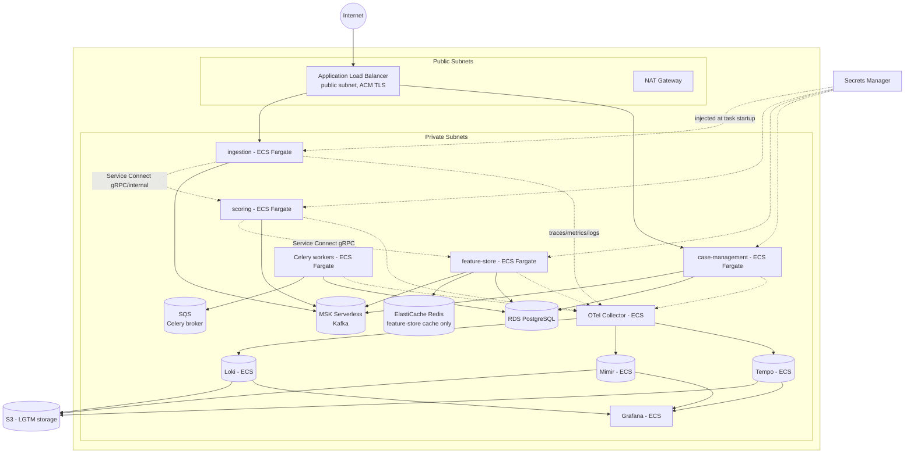

# AWS Deployment Plan

Status: design doc, phase-two (explicitly out of scope for the week-one build — see `docs/plan.md`). Maps the local Docker Compose topology in `docs/ARCHITECTURE.md` onto AWS, with the same decision-by-decision, options-and-tradeoffs treatment.

## 1. Decision-by-decision options

### Compute platform: where do the 4 services + Celery workers run?

**Option A: ECS Fargate (recommended)**
Each service (`ingestion`, `scoring`, `feature-store`, `case-management`) and the Celery worker pool as separate ECS services, one task definition each, behind Service Connect for internal discovery.
- *Why*: no cluster/node management, scales per-service independently, and the "why is each service its own ECS service with its own scaling policy" story is exactly the kind of thing that reads as deliberate architecture rather than "I ran everything on one box." Fastest to stand up correctly.

**Option B: EKS**
Same services as Kubernetes Deployments, Helm charts, possibly a service mesh (App Mesh / Istio) for mTLS between services.
- *Tradeoff*: stronger signal if the target audience specifically cares about Kubernetes depth (many chief-architect interviews do probe this), but materially more operational surface — cluster upgrades, node group management, CNI/networking, IAM-to-K8s-RBAC mapping (IRSA). Worth doing as an explicit follow-on phase (see §5), not the first AWS iteration.

**Option C: EC2 Auto Scaling Groups, self-managed containers**
- *Tradeoff*: full control, no platform lock-in, but you're now also the one patching AMIs and managing orchestration primitives ECS/EKS give you for free. No upside here over A or B for this project — rejected.

**My call: Option A first, Option B as a documented phase-two migration** (§5) — this gives you a genuine "I chose Fargate for velocity, and here's exactly what I'd change and why to move to EKS at higher scale" answer, which is a stronger architect signal than jumping straight to K8s.

### Kafka: MSK vs. self-hosted vs. serverless alternative

**Option A: Amazon MSK (provisioned)**
Managed Kafka brokers in your VPC, standard Kafka protocol — no application code changes needed from the local Compose version.
- *Tradeoff*: real production-grade Kafka, but has a broker-hour cost floor even at low/no traffic (3 brokers minimum for HA) — the most expensive line item in this whole plan for a portfolio project that isn't taking real traffic.

**Option B: MSK Serverless (recommended for this project)**
Same managed Kafka, but billed per-partition-throughput rather than per-broker-hour.
- *Why*: for a demo/portfolio workload with bursty, low-baseline traffic, this avoids paying for idle broker capacity 24/7 while keeping the exact same Kafka semantics (topics, consumer groups, partitioning) the architecture doc already commits to. Trivial to swap to provisioned MSK later purely as a config/Terraform change once real sustained throughput exists — that migration path is itself worth a line in the doc.

**Option C: Self-hosted Kafka (or Redpanda, Kafka-API-compatible) on EC2/Fargate**
- *Tradeoff*: cheapest at idle, but you're now operating a stateful distributed system yourself (partition rebalancing, disk management, broker failure recovery) — the operational burden a managed service exists to remove. Only worth it if self-hosting Kafka is itself a skill you're deliberately showcasing; otherwise it's effort spent on the wrong thing.

**My call: Option B.** It keeps the "why Kafka" story from the core architecture doc completely intact while matching cost to actual usage — the correct trade-off for a project meant to demonstrate judgment, not just deploy managed services because they exist.

### Data stores

| Local (Compose) | AWS | Notes |
|---|---|---|
| Postgres (shared instance, schema-isolated) | **RDS for PostgreSQL**, single instance, Multi-AZ optional | Multi-AZ adds cost for a portfolio project with no real uptime SLA to defend — start Single-AZ, document Multi-AZ as the prod-readiness step (§5). |
| Redis (feature-store hot cache) | **ElastiCache for Redis** | Same rationale as Postgres on Multi-AZ/cluster-mode — start single-node, document the scaling path. |
| Redis (Celery broker) | **Amazon SQS**, not ElastiCache (see below) | |

**Celery broker on AWS — a real decision, not a defaults choice.** Local Compose uses Redis as the Celery broker because it's already in the stack. On AWS, Celery supports SQS as a broker natively, and SQS removes an entire stateful component (no ElastiCache node to manage just for queueing) while adding durability guarantees Redis-as-broker doesn't give you for free (message persistence, dead-letter queues as a first-class SQS feature — directly useful for the "poison message" handling flagged as a gap in the architecture review). **Recommendation: SQS as the Celery broker on AWS**, keep ElastiCache Redis scoped to its actual job (feature-store hot cache). Document this as a deliberate divergence from local Compose, not an inconsistency.

### Networking & inter-service gRPC

- VPC with public subnets (ALB only) and private subnets (all services, RDS, ElastiCache, MSK) — nothing except the ALB has a public IP.
- **North-south** (`ingestion`'s public REST API): Application Load Balancer, ACM-issued TLS cert, public subnet.
- **East-west gRPC** (`scoring` → `feature-store`): ALB supports native gRPC target groups, but for internal-only service-to-service calls, **ECS Service Connect** (recommended) gives you service discovery + internal load balancing without provisioning a second internet-facing load balancer for traffic that should never leave the VPC. Document this distinction explicitly — it's a common junior mistake to put every service behind a public ALB.
- NAT Gateway for outbound (package installs, AWS API calls from within private subnets) — one per AZ for HA, or a single shared one to cut cost for a non-prod portfolio deployment (call out the tradeoff, don't silently pick the cheap option without saying so).

### Observability stack (Loki / Mimir / Tempo / Grafana)

AWS has no managed Loki/Mimir/Tempo. Two real options:

**Option A: Self-host the LGTM stack on the same ECS cluster (recommended)**
Loki, Mimir, Tempo, Grafana each as their own ECS Fargate service, backed by S3 for chunk/block storage (all three support S3-compatible object storage backends — this is the standard production pattern for this stack, not a compromise).
- *Why*: keeps the exact stack decided in `docs/ARCHITECTURE.md` (the OTel Collector → Loki/Mimir/Tempo story is itself part of what's being demonstrated), and S3-backed storage means these components stay cheap and durable without managing EBS volumes or replication yourself.

**Option B: Grafana Cloud (SaaS, hosted Loki/Mimir/Tempo/Grafana)**
Point the OTel Collector's exporters at Grafana Cloud endpoints instead of self-hosted backends.
- *Tradeoff*: zero infrastructure to run for the observability stack, generous free tier — genuinely attractive for a portfolio project where the point is demonstrating the *instrumentation and trace-correlation story*, not proving you can operate Loki/Mimir/Tempo at scale. Costs real money past the free tier if used for sustained load testing.

**My call: Option A for the "I can run this stack" story, but explicitly note Option B as the pragmatic choice if the goal is cost/time efficiency rather than demonstrating operating the observability backend itself** — worth stating both and letting the actual goal (interview demo vs. cost-minimized side project) decide.

### IaC and CI/CD

- **Terraform** (recommended over CDK/CloudFormation) — cloud-agnostic reasoning, the de facto industry standard for "can this person operate infra as code," and modules map cleanly onto the decision table above (one module per: VPC, ECS cluster, MSK, RDS, ElastiCache, each service).
- **CI/CD**: GitHub Actions — build/push image to ECR on merge, `terraform plan` on PR (posted as a PR comment for review), `terraform apply` + ECS service deploy on merge to main. This is also where the Day-7 unit test suite from `docs/plan.md` becomes a real gate, not just a local habit — CI fails the pipeline if `pytest` fails.
- **Secrets**: AWS Secrets Manager for DB credentials/API keys, injected into ECS task definitions via `secrets` (not environment variables baked into the image or Terraform state).

## 2. Target architecture diagram

## 3. Environment strategy

Single AWS account, two environments to start, driven by the same Terraform modules with different variable files (`dev.tfvars`, `staging.tfvars`) — not a full prod-grade multi-account setup (Organizations, separate accounts per environment) unless the goal is specifically demonstrating account-isolation/landing-zone design, which is a distinct and larger piece of work called out separately in §5.

- **dev**: minimal sizing (smallest Fargate task sizes, single-AZ RDS/ElastiCache, MSK Serverless), torn down when not actively demoing to avoid idle cost.
- **staging**: closer to a "real" sizing pass, used for the Day-7 load test from `docs/plan.md` run against real AWS infrastructure instead of local Docker — this is what actually validates the p99 < 100ms SLA claim, since local Compose latency numbers don't reflect real network hops between AZs/services.

## 4. Rough cost shape (verified against current pricing, Aug 2026)

Corrected from an earlier, too-optimistic pass — actual rates checked against AWS's pricing pages rather than assumed. Figures are 24/7 monthly cost, us-east-1, minimal sizing:

| Component | Rate | ~Monthly (730 hrs) |
|---|---|---|
| NAT Gateway | $0.045/hr + $0.045/GB processed | ~$33 |
| ALB | $0.0252/hr + $0.008/LCU-hr | ~$22–24 |
| ECS Fargate (10 tasks: 4 services + Celery + OTel Collector + Loki/Mimir/Tempo/Grafana, 0.25 vCPU/0.5GB each) | $0.04048/vCPU-hr + $0.00444/GB-hr | ~$85–90 |
| RDS db.t4g.micro | ~$0.016/hr + storage | ~$12–15 |
| ElastiCache cache.t4g.micro | ~$0.016/hr | ~$12 |
| MSK Serverless | $0.0015/partition-hr confirmed; a $0.75/hr **cluster charge** is cited by third-party pricing aggregators but not confirmed on AWS's own MSK pricing page — verify directly before relying on it | unverified, potentially $50–550+ |

**This is the opposite of cheap.** NAT Gateway and ALB charge by the hour regardless of traffic, and Fargate cost multiplies with task count, not with actual load — none of these three "scale to zero" on their own the way the earlier draft of this section implied. Excluding MSK entirely, this stack still runs **~$165–175/month** continuously. See §6 for what this means against the $200/6-month free-tier credit specifically, and for the actual low-cost alternative.

Tearing down `dev` outside of active demo/interview windows (Terraform makes this a one-command `destroy`/`apply` cycle) remains the single biggest lever if the ECS/MSK/RDS/ElastiCache architecture is used at all — but for the free-tier period, §6's single-instance variant avoids needing that discipline in the first place.

## 5. Explicitly deferred (documented, not built)

- **EKS migration** — Option B from §1, as a follow-on doc (`docs/deployment-eks.md`) once Fargate is running, demonstrating an intentional "why we'd move, and to what" narrative rather than defaulting to Kubernetes on day one.
- **Multi-account landing zone** (AWS Organizations, separate dev/staging/prod accounts, SCPs) — a real enterprise pattern, but a distinct body of work from this application's deployment and disproportionate for a portfolio project's actual environment count.
- **Multi-region** — not warranted without a stated DR/latency requirement driving it; adding it without a reason is a red flag in review, not a strength.
- **WAF / DDoS protections (Shield Advanced)** in front of the ALB — reasonable for a real production fintech system, out of scope while this is a demo without real user traffic or real money at risk.

## 6. Free-tier-constrained variant

§3's "dev"/"staging" environments on the ECS/MSK/RDS/ElastiCache architecture are the right target shape **once real budget exists** — §1 through §5 stay as written for that case. They are not what gets deployed under a $200/6-month credit; this section covers that case specifically.

**Bottom line**: the account structure itself forces the decision. For any AWS account created after July 15, 2025, the classic "12 months free EC2/RDS" allowances no longer exist — new accounts get a flat $200 credit, drawn down by usage across every service, and the account closes automatically at 6 months (or sooner if credits run out first), whichever comes first. Given §4's numbers, the full ECS/MSK/RDS/ElastiCache/NAT/ALB architecture exhausts that credit in **roughly 5–6 weeks of continuous running — excluding Kafka** — not 6 months. It is the wrong architecture to deploy under this constraint, independent of any Terraform/ops discipline applied to it.

### The variant: one EC2 instance running the existing Docker Compose stack

Instead of translating every local Compose service into a separate managed AWS component, run `docker-compose.yml` from `docs/plan.md` **unmodified** on a single EC2 instance:

- **Instance**: `t4g.small` (2 vCPU/2GB, ~$0.0168/hr ≈ $12.3/month) or `t4g.medium` (4GB, ~$0.0336/hr ≈ $24.5/month) if the full LGTM stack alongside Kafka/Postgres/Redis needs more headroom — either comfortably fits $200 across 6 months even run continuously, with the vast majority of the credit untouched.
- **No NAT Gateway** — the instance sits in a public subnet with a single Elastic IP; a security group restricts inbound to only the ports actually exposed (`ingestion` and `case-management` REST ports, Grafana), everything else stays loopback/internal to the instance.
- **No ALB** — direct access via the instance's public IP (or a Route 53 A record pointed at it, if a stable hostname matters for a demo link), optionally behind a lightweight reverse proxy (nginx/Caddy container, already trivial to add to the Compose file) for TLS termination via Let's Encrypt instead of paying for ACM+ALB.
- **No MSK, no RDS, no ElastiCache** — Kafka, Postgres, and Redis stay exactly what they are in local dev: containers in the same Compose file, on the same instance. This is the same trade-off already made and documented for local development (`docs/ARCHITECTURE.md` §7) — same reasoning applies here, just now it's also running somewhere with a public URL.
- **Storage**: default EBS gp3 volume (20–30GB is generous for Postgres/Kafka/Loki-Mimir-Tempo data at demo scale) — a few dollars a month, not worth optimizing further at this scale.

**What this costs**: instance (~$12–25/month) + EBS (~$2–3/month) + minor data transfer ≈ **$15–30/month**, or **$90–180 across 6 months** even run continuously — inside the $200 credit with margin, and dramatically cheaper if stopped between demo/interview sessions (EC2 stop/start is a single command, unlike tearing down and rebuilding a multi-service ECS+MSK+RDS+ElastiCache stack).

**What this gives up, on purpose**: no managed-service durability/HA story, no real multi-AZ, no independent per-service scaling — none of which a portfolio demo on a free-tier credit needs, and all of which would cost real money to get. That gap is not a hole in the story; it *is* the story: §1 through §5 above document the target production architecture and exactly why each managed service exists, and this section documents the deliberately different choice made for the free-tier/demo period and exactly why. Being able to articulate both — and the line between them — is stronger than defaulting to either extreme.

**Practical setup notes**:
- Enable AWS Budgets with an alert at ~$150 (this is itself one of the five $20 onboarding credit tasks — configuring a cost budget — so it's free to set up and directly extends the runway it's protecting).
- Point the OTel Collector at self-hosted Loki/Mimir/Tempo on the same instance exactly as in local Compose — no change needed from `docs/ARCHITECTURE.md` §6.
- If the instance is only needed for scheduled demos/interviews rather than continuous availability, stopping it between sessions (billed only for EBS storage while stopped, not compute) turns the realistic 6-month cost into closer to $20–40 total.
